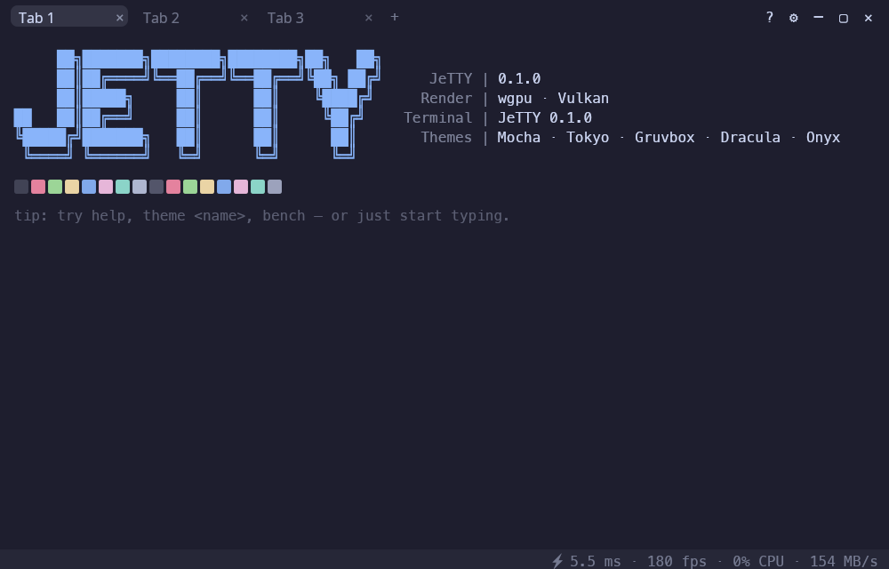
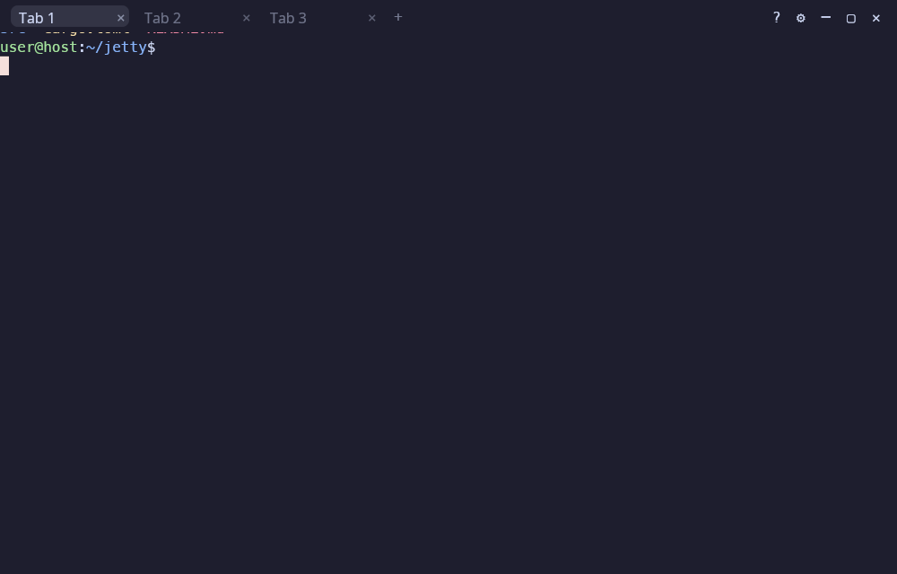
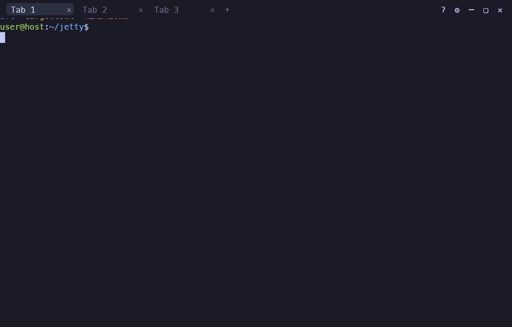
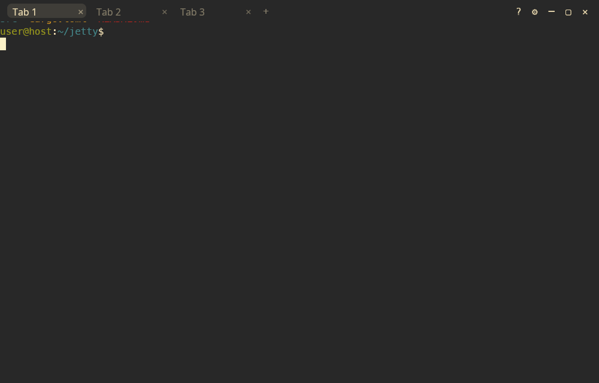
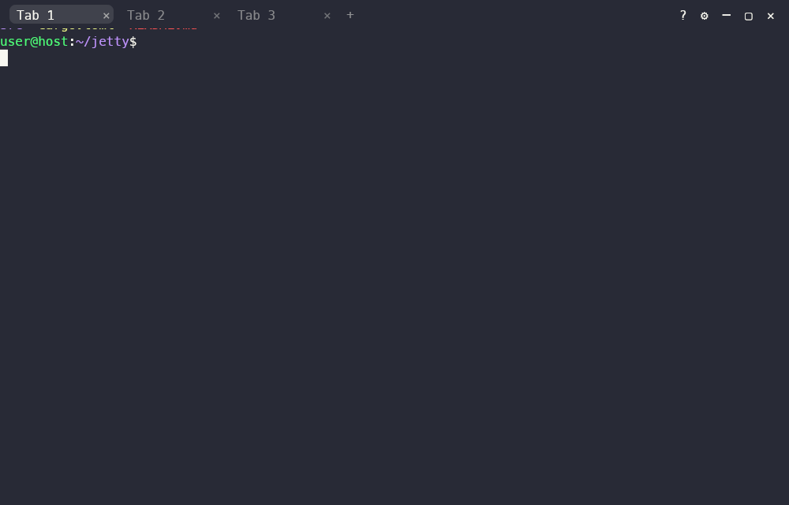
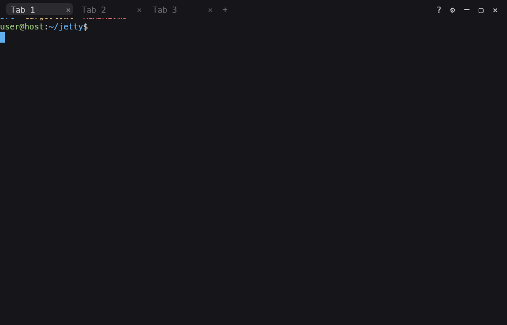
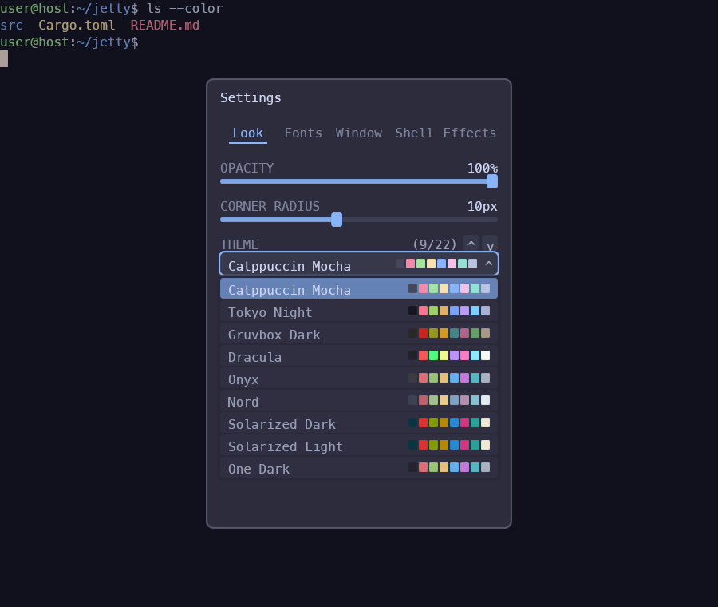
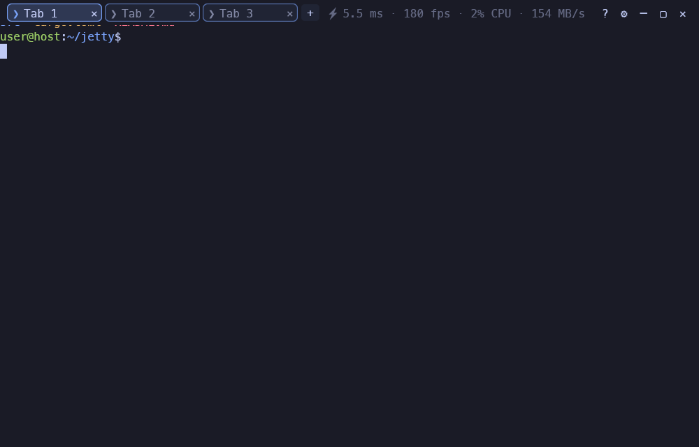

<div align="center">

# ⚡ JeTTY

**A blazing-fast, GPU-accelerated terminal that summons to the center of your screen — or drops down Yakuake-style — on a global hotkey.**

*Je**TTY** — a terminal (**TTY**) that moves like a **Jet**. Raw speed is its first priority, above everything else.*

[](https://github.com/bozdemir/JeTTY/actions/workflows/ci.yml)
[](https://github.com/bozdemir/JeTTY/releases/latest)




</div>

---

> 🤝 **JeTTY is young and looking for collaborators!** If you love terminals, Rust, or GPU rendering, come help shape a fast, beautiful terminal — see [Collaborators wanted](#-collaborators-wanted).

## Contents

- [Features](#-features)
- [Screenshots](#-screenshots)
- [Install](#-install)
- [Keybindings](#️-keybindings)
- [Performance](#-performance)
- [Architecture](#-architecture)
- [Collaborators wanted](#-collaborators-wanted)
- [Roadmap](#️-roadmap)
- [License](#-license)

## ✨ Features

- 🚀 **Blazing fast** — GPU-rendered with [`wgpu`](https://github.com/gfx-rs/wgpu); ~5.5 ms full-screen frames (144 Hz-ready), **~0 % CPU when idle** (damage-driven redraw), 150+ MB/s VT throughput. See the [performance budget](docs/perf-budget.md).
- 🎯 **Global summon hotkey** — press **F9** anywhere to bring JeTTY up. Two modes (switchable in settings):
  - **Center** — drops into the middle of your screen.
  - **Dropdown** — slides down from the top edge, full screen width, Yakuake/Guake style, with adjustable width & height.
- ✨ **Summon effects** — five self-written GPU reveal shaders, selectable in settings: **Phosphor Ignition** (default — CRT power-on), **Bayer Crystallize**, **Liquid Drop**, **Focus Pull**, or **None**.
- 🗂️ **Tabs** — `Ctrl+Shift+T` new, `Ctrl+Shift+W` close (with confirm), `Ctrl+Tab` / `Ctrl+1‒9` switch, double-click to rename.
- 🎨 **5 beloved themes** — Catppuccin Mocha (default), Tokyo Night, Gruvbox Dark, Dracula, and Onyx, with exact community palettes. Every UI surface (panel, menus, tab bar, welcome, confirm dialogs) re-skins with the active theme.
- 🪟 **Custom-decorated window** — borderless client-side decorations, our own title bar, rounded corners (radius slider), runtime opacity.
- 🔤 **Live font control** — change font **size** (`Ctrl + +/-/0`) and **family** (any installed monospace) at runtime, no restart.
- 📋 **Selection & clipboard** — drag to select (auto-copies), right-click **Copy / Paste / Select All** menu, `Ctrl+Shift+C/V`, middle-click paste, bracketed-paste aware.
- ⚙️ **Settings dialog** — `Ctrl+Shift+P` opens a movable dialog (theme, opacity, corner radius, summon effect, window mode, dropdown size, tab-bar position, focus auto-hide, welcome splash, performance HUD, font) — all **persisted** to `~/.config/jetty/config.toml`.
- 📊 **Live performance HUD** — an optional tab-bar overlay showing frame ms · fps · CPU% · VT MB/s in real time, and an honest "idle" state when the app settles (never forces a redraw — idle stays ~0% CPU). Toggle with `show_perf_hud`.
- 👋 **Welcome overlay** — a neofetch-style splash on first launch (accent ASCII logo + version/backend), dismissed on the first key/click/Esc. Toggle with `show_welcome`.
- 🖥️ **Desktop-independent** — X11 **and** Wayland, KDE / GNOME / any compositor, every distro. **No DE-specific code**, no compositor libraries.
- ✅ **A real terminal** — true-color, answers host queries (DSR/DA), proper `TERM`, window resize with grid reflow, 10k-line scrollback, Ctrl+D closes cleanly.

## 📸 Screenshots

| Catppuccin Mocha | Tokyo Night |
|:---:|:---:|
|  |  |
| **Gruvbox Dark** | **Dracula** |
|  |  |
| **Onyx** | **Settings (theme cards)** |
|  |  |

| Summon effect (Phosphor Ignition) | Live perf HUD |
|:---:|:---:|
|  |  |

*(Screenshots pending regeneration for Onyx, perf-HUD, and updated settings panel — see `docs/perf-budget.md` for the regeneration commands.)*

## 🚀 Install

JeTTY runs on **Linux** (X11 / Wayland, Vulkan) and **macOS** (Metal). Building from source needs only the Rust toolchain and works on both.

### 🍎 macOS — build from source

```bash
# 1. Install Rust (skip if you already have it)
curl --proto '=https' --tlsv1.2 -sSf https://sh.rustup.rs | sh && source "$HOME/.cargo/env"

# 2. Build + run
git clone https://github.com/bozdemir/JeTTY.git && cd JeTTY
cargo build --release
./target/release/jetty
```

Renders through **Metal**. Summon with **F9** — on Mac keyboards where the function-row keys default to media actions, press `fn`+`F9` so the OS delivers F9. You can also bind `jetty --toggle` to a shortcut via a launcher (the first press launches JeTTY; each subsequent press toggles the running instance via the single-instance socket). A locally built binary is not quarantined, so there's no Gatekeeper prompt. *(Prebuilt `.app` / `.dmg` are on the [roadmap](#-roadmap).)*

### 🐧 Linux — one-line installer (prebuilt, no toolchain)

```bash
curl -fsSL https://raw.githubusercontent.com/bozdemir/JeTTY/main/install.sh | sh
```

Installs to `~/.local/bin` by default. The script verifies the published `SHA256SUMS.txt` checksum before installing. For a system-wide install:

```bash
curl -fsSL https://raw.githubusercontent.com/bozdemir/JeTTY/main/install.sh | JETTY_PREFIX=/usr/local sudo -E sh
```

Also available: a launcher entry. Or grab a `.deb` / **AppImage** from the [latest release](https://github.com/bozdemir/JeTTY/releases/latest):

```bash
sudo apt install ./jetty_*_amd64.deb                              # Debian / Ubuntu
chmod +x JeTTY-*-x86_64.AppImage && ./JeTTY-*-x86_64.AppImage     # any distro
```

### Build from source (Linux or macOS)

```bash
git clone https://github.com/bozdemir/JeTTY.git && cd JeTTY
cargo build --release && ./target/release/jetty
```

> Prebuilt artifacts (`.deb`, AppImage, tarball, checksums) are published by CI when a `v*` tag is pushed — **Linux x86_64 today; macOS prebuilt builds are on the roadmap.** Until then, macOS users build from source (above).

### Global summon hotkey

- **X11** — `F9` works immediately, no setup.
- **Wayland** — Wayland routes global shortcuts through the compositor, so bind **`jetty --toggle`** to a key (first press launches JeTTY; each press after toggles the running instance via the single-instance socket; `--show` / `--hide` set the state explicitly). See [`docs/global-hotkey.md`](docs/global-hotkey.md). *(Note: in Dropdown mode, top-edge anchoring relies on window positioning, which the compositor controls on Wayland — it works fully on X11.)*

## ⌨️ Keybindings

| Key | Action |
|---|---|
| `F9` | Summon / hide JeTTY (global; `fn`+`F9` on macOS) |
| `Ctrl+Shift+P` | Open settings dialog |
| `Ctrl+Shift+T` | New tab |
| `Ctrl+Shift+W` | Close tab (with confirm) |
| `Ctrl+Tab` / `Ctrl+Shift+Tab` | Next / previous tab |
| `Ctrl+1`‒`9` | Jump to tab |
| `Ctrl` + `+` / `-` / `0` | Font size up / down / reset |
| `Ctrl+Shift` + `+` / `-` | Opacity up / down |
| Left-drag | Select text (auto-copies) |
| Right-click | Copy / Paste / Select All / Clear / Close Tab menu |
| `Ctrl+Shift+C` / `Ctrl+Shift+V` | Copy / Paste |
| `Ctrl+D` | Close the shell (and window) |

*Theme is chosen by clicking a theme card in the Settings dialog (`Ctrl+Shift+P`) — there is no theme keybinding.*

## ⚡ Performance

Measured headlessly on an Intel Arc iGPU at 1920×1200 (`cargo run --release -p jetty-app --bin jetty-bench`):

| Metric | JeTTY | Target |
|---|---|---|
| Frame render (full screen) | **5.5 ms** (180 fps cap) | ≤ 6.9 ms (144 Hz) |
| Idle CPU | **~0 %** | 0 % |
| Per-frame snapshot (11k cells) | **0.047 ms** | ≤ 1 ms |
| VT throughput | **154 MB/s** | ≥ 150 MB/s |

Speed is a gated requirement, not an afterthought — see [`docs/perf-budget.md`](docs/perf-budget.md).

## 🧱 Architecture

A small Cargo workspace with clear boundaries:

| Crate | Responsibility |
|---|---|
| `jetty-core` | VT model (alacritty_terminal), PTY, themes, grid snapshot |
| `jetty-render` | GPU layers — text (glyphon/cosmic-text), quads, panel, menu, summon-effect shaders |
| `jetty-platform` | Window creation (winit), raw-window-handle plumbing |
| `jetty-app` | Event loop, input, clipboard, tabs, settings, hotkey, window modes, the binary |

## 🤝 Collaborators wanted

JeTTY is in active early development and **we're looking for collaborators.** Whether you want to own a feature, fix a bug, or just trade ideas — you're welcome, at any experience level.

Great places to jump in right now:

- Native Wayland global shortcut (XDG GlobalShortcuts portal)
- Multi-monitor awareness & per-monitor dropdown placement
- More summon effects / themes / visual polish
- Faster cold start
- Packaging (PPA, AUR, Flatpak research), docs

**How to get involved:** open an [issue](https://github.com/bozdemir/JeTTY/issues) or discussion, or send a pull request. New to the code? The [architecture](#-architecture) section is a good place to start.

## 🗺️ Roadmap

- Native Wayland global shortcut via the XDG GlobalShortcuts portal
- Multi-monitor awareness
- Launchpad PPA (`apt install jetty`) + AUR package
- Faster cold start
- More summon effects and themes

## 📄 License

MIT — see [`LICENSE`](LICENSE).

---

<div align="center"><sub>Built in Rust. Speed first. 🚀</sub></div>
