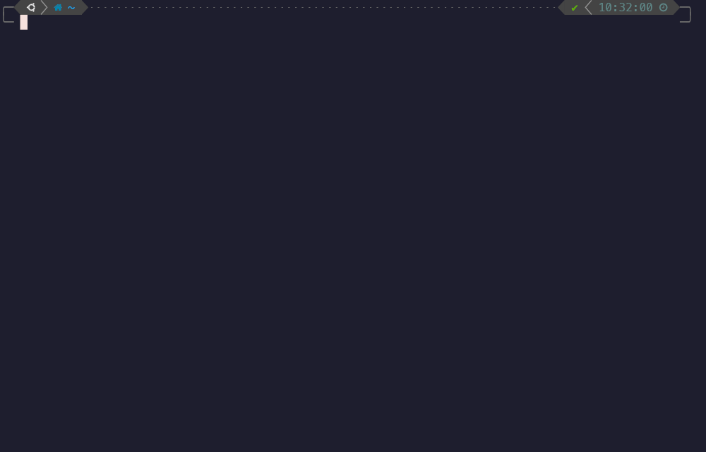
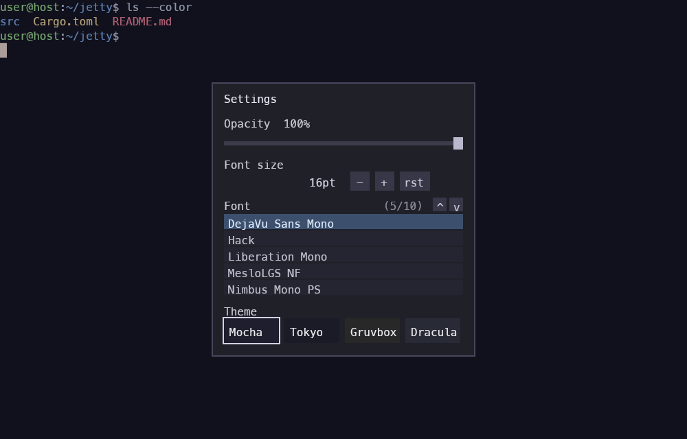
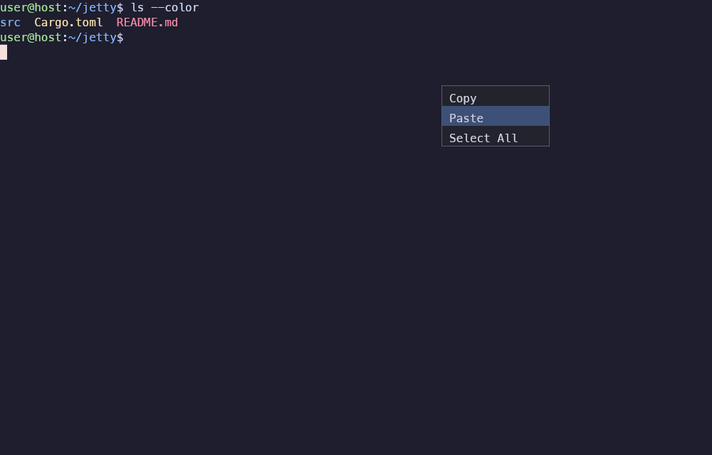
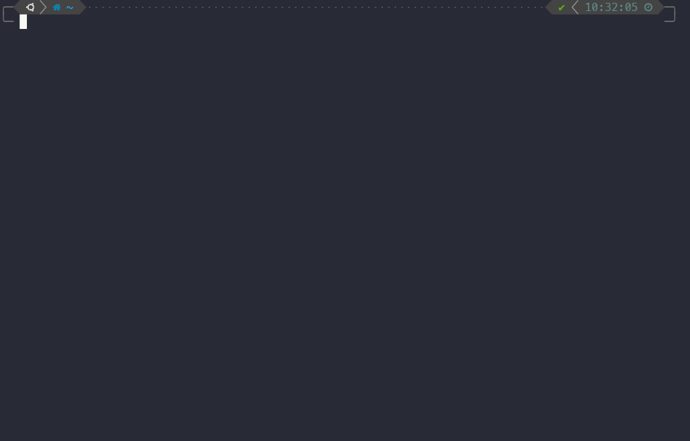

<div align="center">

# ⚡ Jetty

**A blazing-fast, GPU-accelerated terminal that drops into the center of your screen on a global hotkey.**

*Jetty is named after the **Jet** — raw speed is its first priority, above everything else.*




</div>

---

## ✨ Features

- 🚀 **Blazing fast** — GPU-rendered with [`wgpu`](https://github.com/gfx-rs/wgpu); ~5.5 ms full-screen frames (144 Hz-ready), **~0 % CPU when idle** (damage-driven redraw), 150+ MB/s VT throughput. See the [performance budget](docs/perf-budget.md).
- 🎯 **Center-summon global hotkey** — press **F9** anywhere to drop Jetty into the middle of your screen, Yakuake-style. Works on **X11** out of the box and on **Wayland** via `jetty --toggle`.
- 🎨 **Beloved themes** — Catppuccin Mocha (default), Tokyo Night, Gruvbox, Dracula, with exact community palettes. Cycle with `Ctrl+Shift+T` or pick in the settings dialog.
- 🔤 **Live font control** — change font **size** (`Ctrl + +/-/0`) and **family** (any installed monospace font) at runtime, no restart.
- 📋 **Selection & clipboard** — drag to select (auto-copies), right-click for a **Copy / Paste / Select All** menu, `Ctrl+Shift+C/V`, middle-click paste, bracketed-paste aware.
- 🪟 **Settings dialog** — `Ctrl+Shift+P` opens a movable, centered dialog for theme, opacity, font size and font family.
- 🌫️ **Transparency** — adjustable background opacity, composited by the app.
- 📜 **Scrollback** — 10k lines, draggable scrollbar.
- 🖥️ **Desktop-independent** — X11 **and** Wayland, KDE / GNOME / any compositor, every distro. No DE libraries required.
- ✅ **A real terminal** — true-color, answers host queries (DSR/DA), proper `TERM`, window resize with grid reflow, control keys, Ctrl+D closes cleanly.

## 📸 Screenshots

| Settings dialog | Right-click menu | Dracula theme |
|:---:|:---:|:---:|
|  |  |  |

## ⚡ Performance

Measured headlessly on an Intel Arc iGPU at 1920×1200 (`cargo run --release -p jetty-app --bin jetty-bench`):

| Metric | Jetty | Target |
|---|---|---|
| Frame render (full screen) | **5.5 ms** (180 fps) | ≤ 6.9 ms (144 Hz) |
| Idle CPU | **~0 %** | 0 % |
| Per-frame snapshot (11k cells) | **0.047 ms** | ≤ 1 ms |
| VT throughput | **154 MB/s** | ≥ 150 MB/s |

Speed is a gated requirement, not an afterthought — see [`docs/perf-budget.md`](docs/perf-budget.md).

## ⌨️ Keybindings

| Key | Action |
|---|---|
| `F9` | Summon / hide Jetty (global) |
| `Ctrl+Shift+P` | Open settings dialog |
| `Ctrl+Shift+T` | Cycle theme |
| `Ctrl` + `+` / `-` / `0` | Font size up / down / reset |
| `Ctrl+Shift` + `+` / `-` | Opacity up / down |
| Left-drag | Select text (auto-copies) |
| Right-click | Copy / Paste / Select All menu |
| `Ctrl+Shift+C` / `Ctrl+Shift+V` | Copy / Paste |
| `Ctrl+D` | Close the shell (and window) |

## 🚀 Install & run

Requires a recent Rust toolchain.

```bash
git clone https://github.com/bozdemir/jetty.git
cd jetty
cargo build --release
./target/release/jetty
```

### Global summon hotkey

- **X11** — `F9` works immediately, no setup.
- **Wayland** — Wayland routes global shortcuts through the compositor, so bind a key to `jetty --toggle` (it toggles the running instance via a single-instance socket). Details and per-desktop instructions in [`docs/global-hotkey.md`](docs/global-hotkey.md).

## 🎨 Themes

Catppuccin Mocha · Tokyo Night · Gruvbox Dark · Dracula — switch with `Ctrl+Shift+T` or the settings dialog. (Solarized Dark/Light and a generic dark palette are also available by name via `JETTY_THEME`.)

## 🧱 Architecture

A small Cargo workspace with clear boundaries:

| Crate | Responsibility |
|---|---|
| `jetty-core` | VT model (alacritty_terminal), PTY, themes, grid snapshot |
| `jetty-render` | GPU layers — text (glyphon/cosmic-text), quads, panel, menu |
| `jetty-platform` | Window creation (winit), raw-window-handle plumbing |
| `jetty-app` | Event loop, input, clipboard, settings, hotkey, the binary |

## 🗺️ Roadmap

- Center-overlay summon animation & polish
- Native Wayland global shortcut via the XDG GlobalShortcuts portal
- Tabs + drag-to-reorder
- Multi-monitor awareness
- Faster cold start (currently the one perf metric still being optimized)

## 📄 License

MIT — see [`LICENSE`](LICENSE).

---

<div align="center"><sub>Built in Rust. Speed first. 🚀</sub></div>
